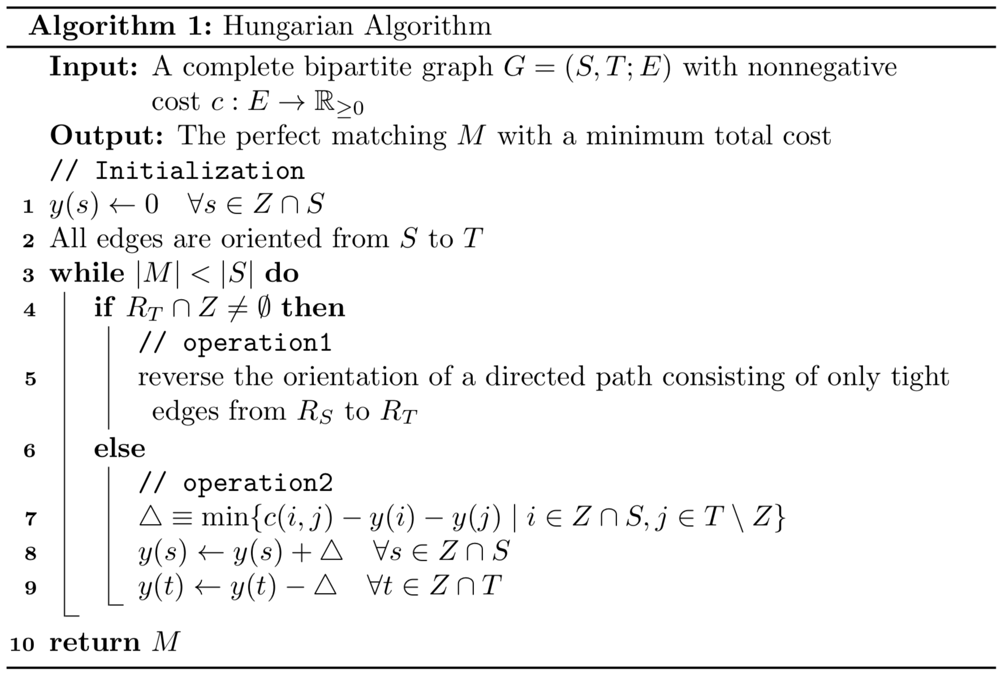

## ハンガリー法(Hungarian_Algorithm)

### 概要とアルゴリズムの実装例

{% pdf src="hungarian.pdf", width="100%", height="600" %}

### 定式化

完全2部グラフ(complete bipartite graph)$$G =(S, T; E)$$と枝の非負のコスト$$c:E \to \mathbb{R}_{\ge0}$$が与えられた時に,最小コストを達成する完全マッチング(perfect matching)を求める問題

ここで完全マッチング$$M \subset E$$のコストは$$\sum_{e \in M} c(e)$$とする.

### 定義

* 関数$$y: (S \cup T) \to \mathbb{R}$$ が$$y(i) + y(j) \le c(i,j)$$を満たす時$$y$$はpotentialと呼ぶ.
* potential $$y$$のvalueを$$\sum_{v \in S \cup T} y(v)$$と定義する.

この時,任意のpotentialのvalueは任意の完全マッチングのコスト以下になっていることは容易に分かる(照明略).

* 枝$$(i,j)$$がpotential $$y$$に対して,$$y(i) + y(j) = c(i,j)$$を満たす時,枝$$(i,j)$$はtight edgeと呼ばれる

ハンガリー法はtight edgeのみから構成される完全マッチングを求めるアルゴリズムである.その時,完全マッチングのコストはpotentialのvalueと一致するので最小コストを達成する完全マッチングであることが分かる.

* potential $$y$$を伴ったグラフ$$G$$を便宜上$$G_y$$と表し,$$G_y$$のorientationを$$\vec{G}_y$$と表す($$G_y$$の枝に向きをつけたもの).ただし,枝の向きはアルゴリズム中で定める.

* $$\vec{G}_y$$上の$$T$$から$$S$$への枝の集合を$$M$$と表す.(アルゴリズムの任意の時点で$$M$$がマッチングとなっていることが後に示される)
* $$R_S \subset S, R_T \subset T$$を$$M$$に含まれていない頂点とする.つまり,$$R_S = \{v \in S \mid v \notin \bigcup_{e \in M} \text{tail}(e) \}$$.ただしtailは枝の終点を表す.$$R_T$$についても同様に定める.
* $$Z \subset S \cup T$$を$$\vec{G}_y$$上で$$R_S$$からtight edgeのみを通って到達可能な頂点集合とする(幅優先探索などで求められる)

### ハンガリー法(Hungarian_Algorithm)

ハンガリー法はtight edgeのみから構成される完全マッチングを求めるアルゴリズム

<left></left>
(操作1)によって,マッチングは1増加する

(操作2)の時$$\{(i,j)\in S \times T \mid i \in Z \cap S, j \in T \setminus Z\}$$が空集合でないことを示す.

$$|M| < |S|$$より$$R_s$$は空でないので,頂点を1つ固定し$$i \in R_s$$とする.ここで,$$R_s \subset Z \cap S$$であるので$$i \in Z \cap S$$である.次に$$j$$の存在を示す.$$|M| < |S| = |T|$$であるので$$R_T$$も空集合ではない.よって,頂点を1つ固定して$$j \in R_T$$とおくことができる.ここで$$j \in Z$$だとすると,$$Z$$の定義より$$R_S$$からtight edgeのみを通って$$j$$に到達するパスがあるが,もしそうならば$$R_T \cap Z \neq \emptyset$$であるので(操作1)が行われるので矛盾.ゆえに$$j \in R_T \setminus Z \subset T \setminus Z$$.

以後,アルゴリズムで常に成立する性質である保存条件とその証明,及び計算量について述べる.

### 保存条件

アルゴリズムで(操作1)と(操作2)を行なっても以下の性質は保たれる.

> **Maintain**
>
> (保存条件1)$$y$$はpotential
>
> (保存条件2)$$\vec{G}_y$$上の$$T$$から$$S$$への枝の集合$$M$$はMathicngとなる
>
> (保存条件3)$$M$$の任意の枝はtight-edgeである

### 保存条件の性質が保たれることを証明

#### 操作1

(保存条件1,3)がこの操作によって保たれることは自明.

(保存条件2)がこの操作によって保たれることを示すには以下を示せば十分.

> パスに含まれる任意の有効枝$$st \in \vec{G}_y$$,$$s \in S$$, $$t \in T$$とする.パスが通る有効枝の向きを全て逆にした時に,$$s$$に流入する$$\vec{G}$$上の有効枝は$$ts$$のみで$$t$$から流出する$$\vec{G}_y$$上の有効枝は$$ts$$のみである.

$$s$$に流入する$$\vec{G}_y$$上の有効枝は$$ts$$のみということだけ示し,残りは読者に委ねる.$$s$$がパスの始点であれば$$R_s$$の元であるので,逆向きにする前には$$\vec{G}_y$$上の有効枝で$$s$$に流入するものは存在しないので,逆向きにした後に,$$s$$に流入する$$\vec{G}$$上の有効枝は$$ts$$のみ.$$s$$がパスの始点でないとすると$$s$$は経由点となるのでパスに含まれる有効枝で$$t's$$となるものが存在する.ここで,(保存条件2)が逆向きにする前に成立していることから,逆向きにする前には$$s$$に流入する$$\vec{G_y}$$上の枝は$$t's$$のみである.ゆえに逆向きにした後では$$s$$に流入する$$\vec{G}$$上の有効枝は$$ts$$のみになる.

#### 操作2

$$
\triangle \equiv 
\min \{ 
	c(i,j) - y(i) - y(j) \mid i \in Z \cap S, j \in T \setminus Z
\}
$$

がpositiveであることを示す.ポテンシャルの定義より$$\triangle$$はnon-negativeである.もし$$\triangle$$が0であるなら,$$i \in Z \cap S$$,$$j \in T \setminus Z$$で$$ij$$がtight edgeであるものが存在する.よって,$$i \in Z$$であるので$$j \in Z$$となるがこれは$$j$$の定義に矛盾.

(保存条件1)がこの操作によって保たれることを示す.

つまり,任意の有効枝に対して端点のpotentialの和が枝のcost以下になることを示す.

$$S$$から$$T$$への任意の有効枝$$ij$$を考えと,$$y(i)$$が$$\triangle$$増加した場合($$i \in Z$$)を考えれば良い.$$j$$が$$Z$$に含まれるなら$$y(j)$$は$$\triangle$$減少するのでpotentialの和は変わらないので,$$j \notin Z$$の場合のみ考えればよい.この時,$$\triangle$$の定義より,$$y(i) + y(j) + \triangle \le c(i,j)$$であるので$$y$$は操作後もpotentialである.$$T$$から$$S$$への有効枝についても同様の議論が行えるので,$$y$$は操作後もpotentialである.

操作2は枝の向きを変えないので,集合$$M$$は不変である.ゆえに(保存条件2)が成立

(保存条件3)が操作後にも保たれることを示す.

操作2で$$M$$は不変であるので,「$$M$$の任意の枝は端点が両方$$Z$$に含まれているか,両方とも$$Z$$に含まれないかいずれかである」ことを示せば十分である.実際,$$vu (v \in T, u \in S)$$が操作後の$$M$$に含まれているなら,操作前にも$$vu$$が$$M$$に含まれており,$$v$$と$$u$$がどちらも$$Z$$に含まれているなら,操作後の端点のpotentialの和は$$y(u)+ \triangle + y(v) - \triangle = y(u) + y(v)$$となり操作前と変わらない.$$v$$と$$u$$がどちらも$$Z$$に含まれていない場合も端点のpotentialの和は操作前と操作後で変わらないので良い.「$$M$$の任意の枝は端点が両方$$Z$$に含まれているか,両方とも$$Z$$に含まれないかいずれかである」ことは以下のように示すことができる.$$vu$$が$$M$$に含まれているとする.$$vu$$は(保存条件3)よりtight-edgeであるので$$v$$が$$Z$$に含まれているなら,必然的に$$u$$も$$Z$$に含まれる.よって,$$v \notin Z \land u \in Z$$として矛盾を導けばよい.$$u \notin R_S$$であるので$$R_S$$の点から$$G_y$$のtight-edgeのみを通って$$u$$に到達するパスが存在する.$$u$$の直前に通る点を$$v' \in T$$とする.この時,$$v'u$$はtight-edgeになるが,これは$$M$$がMatchingであることに矛盾.

### 計算量

$$\mathcal{O}(n^4)$$である.$$n = |S| = |T|$$である.

* (操作1)によってmathcingの数が1増えるので(操作1)は$$n$$回行われる.

* (操作2)を行うことで,$$T \cap Z$$の元が少なくとも1つ増えるので,(操作1)が再び行われる間に(操作2)は最大で$$n$$回行われる.
* (操作2)を一回行う計算量は$$\mathcal{n}^2$$であるので全体の計算量は$$\mathcal{O}(n^4)$$である.
